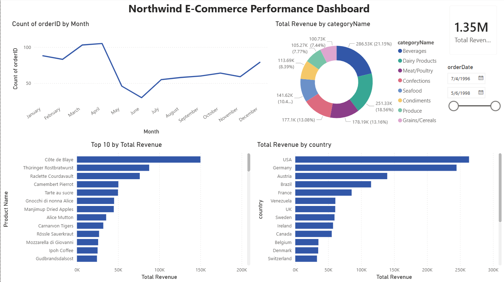

# Data Analytics Portfolio — Sana Shaik

## Project 1: Northwind E-Commerce Analysis
**Tools:** SQL, Power BI

### Dashboard

### SQL Analysis
Business questions answered using SQL:
- Top 5 customers by total revenue
- Revenue by product category
- Month with lowest order volume
- Repeat purchase customers
- Average order value by country
- Top employee by orders processed
